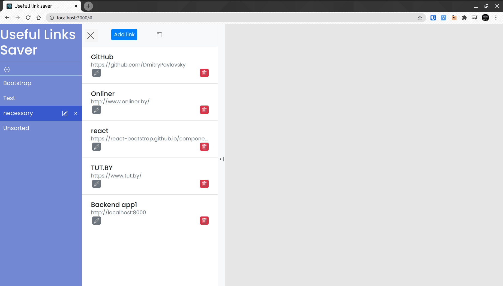
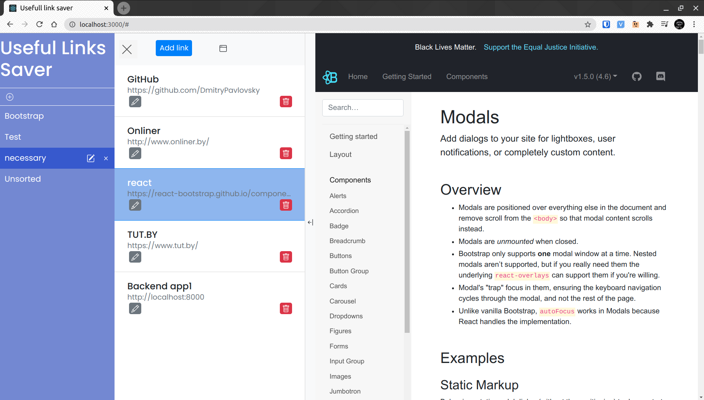
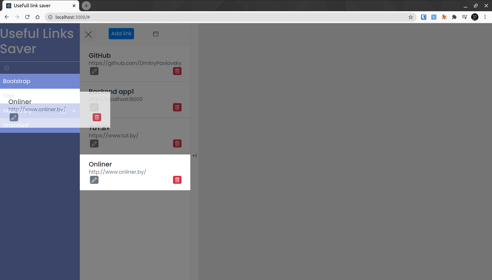

# UsefulLinksSaver

## Description
  The application is designed for comfortable using and saving browser's tabs, when you often have a lot of tabs.
  There are spliting tabs on group, comfortable control of movement between groups, preview site, adding group and tabs in the web application.

## Stack

* Python
* Django 
* Rest Framework
* React
* PostgreSQl
* Bootstrap

## Screenshots

### Main page

### Preview saved link

### Movement link to other group

## Steps
    sodo apt-get install python3 python3-pip nodejs npm postgresql postgresql-contrib
    pip install pipenv
    sudo -u postgres psql
    CREATE DATABASE "Useful_links_db";
    CREATE USER "Useful_links_db_user" WITH PASSWORD 'Useful_links_db_user';
    ALTER ROLE "Useful_links_db_user" SET client_encoding TO 'utf8';
    ALTER ROLE "Useful_links_db_user" SET default_transaction_isolation TO 'read committed';
    ALTER ROLE "Useful_links_db_user" SET timezone TO 'UTC';
    GRANT ALL PRIVILEGES ON DATABASE "Useful_links_db" TO "Useful_links_db_user";
    \q
    git clone https://github.com/DmitryPavlovsky/UsefulLinksSaver.git
    cd UsefulLinkSaver/
    pipenv install --three
    pipenv shell
    cd backend
    python manage.py runserver
    cd ../frontend/
    npm install
    npm start

### for run frontend test 
    cd frontend
    npm test

### for run backend test 
    cd backend
    python manage.py test